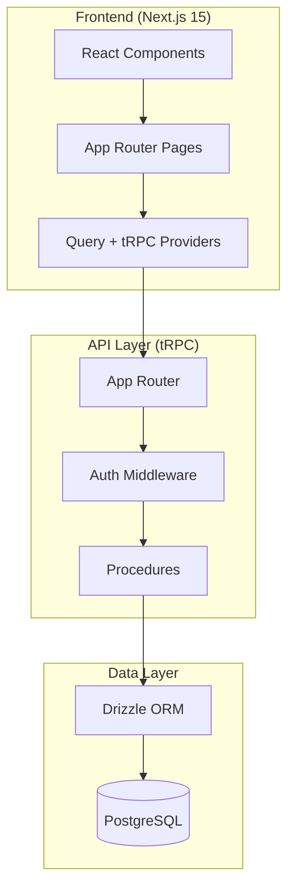

# Architecture Overview

## System Diagram



## Directory Structure

```
src/
├── app/                    # Next.js App Router
│   ├── layout.tsx          # Root layout
│   ├── page.tsx            # Home page
│   ├── providers.tsx       # Client providers
│   ├── globals.css         # Global styles
│   └── [feature]/          # Feature pages
│       └── page.tsx
│
├── components/
│   ├── ui/                 # Shadcn/UI components
│   ├── layout/             # Layout components
│   │   ├── Header.tsx
│   │   └── Sidebar.tsx
│   └── shared/             # Shared components
│       ├── LoadingSpinner.tsx
│       ├── EmptyState.tsx
│       └── ErrorBoundary.tsx
│
├── server/
│   ├── trpc.ts             # tRPC initialization
│   ├── routers/
│   │   ├── _app.ts         # Root router
│   │   └── [module].ts     # Module routers
│   └── middleware/
│       └── auth.ts         # Auth middleware
│
├── db/
│   ├── index.ts            # DB client
│   └── schema/
│       ├── index.ts        # Schema exports
│       └── [table].ts      # Table definitions
│
└── lib/
    ├── utils.ts            # Utility functions
    ├── errors.ts           # Error classes
    └── validation.ts       # Zod schemas
```

## Data Flow

1. **Request**: User interacts with React component
2. **tRPC Call**: Component calls tRPC procedure
3. **Middleware**: Auth middleware validates user
4. **Procedure**: Business logic executes
5. **Database**: Drizzle queries PostgreSQL
6. **Response**: Data flows back to component

## Key Patterns

### Server Components (Default)
```tsx
// src/app/users/page.tsx
export default async function UsersPage() {
  const users = await db.select().from(users);
  return <UserList users={users} />;
}
```

### Client Components
```tsx
// src/components/UserForm.tsx
"use client";

export function UserForm() {
  const mutation = trpc.user.create.useMutation();
  // ...
}
```

### tRPC Procedures
```typescript
// src/server/routers/user.ts
export const userRouter = router({
  getAll: publicProcedure.query(async ({ ctx }) => {
    return ctx.db.select().from(users);
  }),
});
```
